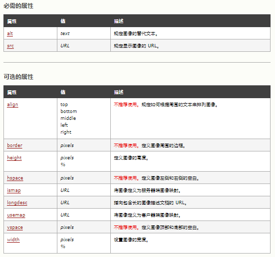

# HTML标签学习总结

## 前言

HTML（英文**<font color=red>H</font>**yper **<font color=red>T</font>**ext **<font color=red>M</font>**arkup **<font color=red>L</font>**anguage的缩写）中文译为“超文本标签语言”，主要是通过HTML标签对网页中的文本、图片、声音等内容进行描述。

### HTML骨架格式

```<HTML>   
<HTML>
    <head>     
        <title></title>
    </head>
    <body>
    
    </body>
</HTML>
```


### HTML标签分类

**什么是 HTML 标签?**

在HTML页面中，带有“< >”符号的元素被称为HTML标签，如上面提到的 &lt;HTML&gt;、&lt;head&gt;、&lt;body&gt;都是HTML标签。所谓标签就是放在“< >” 标签符中表示某个功能的编码命令，也称为HTML标签或 HTML元素。

- HTML 标签是由**尖括号**包围的关键词，比如 `<html> `
- HTML 标签通常是**成对出现**的，比如 `<b> `和 `</b> `
- 某些 HTML 元素没有结束标签，就称为单标签或空标签；比如` <br />`  、`<hr />`
- 标签对中的第一个标签是**开始标签**（start tag），第二个标签是**结束标签** （end tag）
- 开始和结束标签也被称为**开放标签**和**闭合标签** 

### HTML标签关系

标签的相互关系就分为两种：

1. 嵌套关系
```html
<head>  
    <title> </title>  
</head>
```
2. 并列关系
```html
   <head></head>
   <body></body>
```

### HTML标签属性

HTML 属性赋予元素意义和语境。使用HTML制作网页时，如果想让HTML标签提供更多的信息，可以使用HTML标签的属性加以设置。其基本语法格式如下：

```html
<标签名 属性1="属性值1" 属性2="属性值2" …> 内容 </标签名>
```

通常采取 **键值对** 的格式   key="value"  的格式:

```html
<hr width="400" />
```

要注意：

1. 标签可以拥有多个属性，必须写在开始标签中，位于标签名后面。

2. 属性之间不分先后顺序，标签名与属性、属性与属性之间均以空格分开。

3. 任何标签的属性都有默认值，省略该属性则取默认值。

  

## HTML标签

### 按功能类别分类：

#### 基础：

| 标签                                                         | 描述             |
| ------------------------------------------------------------ | ---------------- |
| [<!DOCTYPE>](https://www.w3school.com.cn/tags/tag_doctype.asp) | 定义文档类型。   |
| [&lt;html&gt;](https://www.w3school.com.cn/tags/tag_html.asp) | 定义 HTML 文档。 |
| [<title&gt;](https://www.w3school.com.cn/tags/tag_title.asp) | 定义文档的标题。 |
| [<body&gt;](https://www.w3school.com.cn/tags/tag_body.asp)   | 定义文档的主体。 |
| [<h1&gt;  to <h6&gt;](https://www.w3school.com.cn/tags/tag_hn.asp) | 定义 HTML 标题。 |
| [<p&gt;](https://www.w3school.com.cn/tags/tag_p.asp)         | 定义段落。       |
| [<br&gt;](https://www.w3school.com.cn/tags/tag_br.asp)       | 定义简单的折行。 |
| [&lt;hr&gt;](https://www.w3school.com.cn/tags/tag_hr.asp)    | 定义水平线。     |
| [&lt;!--...--&gt;](https://www.w3school.com.cn/tags/tag_comment.asp) | 定义注释。       |

#### 格式：

| 标签                                                         | 描述                                                         |
| :----------------------------------------------------------- | :----------------------------------------------------------- |
| [&lt;acronym&gt;](https://www.w3school.com.cn/tags/tag_acronym.asp) | 定义只取首字母的缩写。                                       |
| [&lt;abbr&gt;](https://www.w3school.com.cn/tags/tag_abbr.asp) | 定义缩写。                                                   |
| [&lt;address&gt;](https://www.w3school.com.cn/tags/tag_address.asp) | 定义文档作者或拥有者的联系信息。                             |
| [&lt;b&gt;](https://www.w3school.com.cn/tags/tag_font_style.asp) | 定义粗体文本。                                               |
| [&lt;bdi&gt;](https://www.w3school.com.cn/tags/tag_bdi.asp)  | 定义文本的文本方向，使其脱离其周围文本的方向设置。           |
| [&lt;bdo&gt;](https://www.w3school.com.cn/tags/tag_bdo.asp)  | 定义文字方向。                                               |
| [&lt;big&gt;](https://www.w3school.com.cn/tags/tag_font_style.asp) | 定义大号文本。                                               |
| [&lt;blockquote&gt;](https://www.w3school.com.cn/tags/tag_blockquote.asp) | 定义长的引用。                                               |
| [&lt;center&gt;](https://www.w3school.com.cn/tags/tag_center.asp) | <font color=red>不赞成使用。</font>定义居中文本。            |
| [&lt;cite&gt;](https://www.w3school.com.cn/tags/tag_phrase_elements.asp) | 定义引用(citation)。                                         |
| [&lt;code&gt;](https://www.w3school.com.cn/tags/tag_phrase_elements.asp) | 定义计算机代码文本。                                         |
| [&lt;del&gt;](https://www.w3school.com.cn/tags/tag_del.asp)  | 定义被删除文本。                                             |
| [&lt;dfn&gt;](https://www.w3school.com.cn/tags/tag_phrase_elements.asp) | 定义定义项目。                                               |
| [&lt;em&gt;](https://www.w3school.com.cn/tags/tag_phrase_elements.asp) | 定义强调文本。                                               |
| [&lt;font&gt;](https://www.w3school.com.cn/tags/tag_font.asp) | <font color=red>不赞成使用。</font>定义文本的字体、尺寸和颜色 |
| [&lt;i&gt;](https://www.w3school.com.cn/tags/tag_font_style.asp) | 定义斜体文本。                                               |
| [&lt;ins&gt;](https://www.w3school.com.cn/tags/tag_ins.asp)  | 定义被插入文本。                                             |
| [&lt;kbd&gt;](https://www.w3school.com.cn/tags/tag_phrase_elements.asp) | 定义键盘文本。                                               |
| [&lt;mark&gt;](https://www.w3school.com.cn/tags/tag_mark.asp) | 定义有记号的文本。                                           |
| [&lt;meter&gt;](https://www.w3school.com.cn/tags/tag_meter.asp) | 定义预定义范围内的度量。                                     |
| [&lt;pre&gt;](https://www.w3school.com.cn/tags/tag_pre.asp)  | 定义预格式文本。                                             |
| [&lt;progress&gt;](https://www.w3school.com.cn/tags/tag_progress.asp) | 定义任何类型的任务的进度。                                   |
| [&lt;q&gt;](https://www.w3school.com.cn/tags/tag_q.asp)      | 定义短的引用。                                               |
| [&lt;rp&gt;](https://www.w3school.com.cn/tags/tag_rp.asp)    | 定义若浏览器不支持 ruby 元素显示的内容。                     |
| [&lt;rt&gt;](https://www.w3school.com.cn/tags/tag_rt.asp)    | 定义 ruby 注释的解释。                                       |
| [&lt;ruby&gt;](https://www.w3school.com.cn/tags/tag_ruby.asp) | 定义 ruby 注释。                                             |
| [&lt;s&gt;](https://www.w3school.com.cn/tags/tag_s.asp)      | <font color=red>不赞成使用。</font>定义加删除线的文本。      |
| [&lt;samp&gt;](https://www.w3school.com.cn/tags/tag_phrase_elements.asp) | 定义计算机代码样本。                                         |
| [&lt;small&gt;](https://www.w3school.com.cn/tags/tag_font_style.asp) | 定义小号文本。                                               |
| [&lt;strike&gt;](https://www.w3school.com.cn/tags/tag_strike.asp) | <font color=red>不赞成使用。</font>定义加删除线文本。        |
| [&lt;strong&gt;](https://www.w3school.com.cn/tags/tag_phrase_elements.asp) | 定义语气更为强烈的强调文本。                                 |
| [&lt;sup&gt;](https://www.w3school.com.cn/tags/tag_sup.asp)  | 定义上标文本。                                               |
| [&lt;sub&gt;](https://www.w3school.com.cn/tags/tag_sub.asp)  | 定义下标文本。                                               |
| [&lt;time&gt;](https://www.w3school.com.cn/tags/tag_time.asp) | 定义日期/时间。                                              |
| [&lt;tt&gt;](https://www.w3school.com.cn/tags/tag_font_style.asp) | 定义打字机文本。                                             |
| [&lt;u&gt;](https://www.w3school.com.cn/tags/tag_u.asp)      | <font color=red>不赞成使用。</font>定义下划线文本。          |
| [&lt;var&gt;](https://www.w3school.com.cn/tags/tag_phrase_elements.asp) | 定义文本的变量部分。                                         |
| [&lt;wbr&gt;](https://www.w3school.com.cn/tags/tag_wbr.asp)  | 定义可能的换行符。                                           |

#### 表单：

| 标签                                                         | 描述                                                         |
| :----------------------------------------------------------- | :----------------------------------------------------------- |
| [&lt;form&gt;](https://www.w3school.com.cn/tags/tag_form.asp) | 定义供用户输入的 HTML 表单。                                 |
| [&lt;input&gt;](https://www.w3school.com.cn/tags/tag_input.asp) | 定义输入控件。                                               |
| [&lt;textarea&gt;](https://www.w3school.com.cn/tags/tag_textarea.asp) | 定义多行的文本输入控件。                                     |
| [&lt;button&gt;](https://www.w3school.com.cn/tags/tag_button.asp) | 定义按钮。                                                   |
| [&lt;select&gt;](https://www.w3school.com.cn/tags/tag_select.asp) | 定义选择列表（下拉列表）。                                   |
| [&lt;optgroup&gt;](https://www.w3school.com.cn/tags/tag_optgroup.asp) | 定义选择列表中相关选项的组合。                               |
| [&lt;option&gt;](https://www.w3school.com.cn/tags/tag_option.asp) | 定义选择列表中的选项。                                       |
| [&lt;label&gt;](https://www.w3school.com.cn/tags/tag_label.asp) | 定义 input 元素的标注。                                      |
| [&lt;fieldset&gt;](https://www.w3school.com.cn/tags/tag_fieldset.asp) | 定义围绕表单中元素的边框。                                   |
| [&lt;legend&gt;](https://www.w3school.com.cn/tags/tag_legend.asp) | 定义 fieldset 元素的标题。                                   |
| <isindex>                                                    | <font color=red>不赞成使用。</font>定义与文档相关的可搜索索引。 |
| [&lt;datalist&gt;](https://www.w3school.com.cn/tags/tag_datalist.asp) | 定义下拉列表。                                               |
| [&lt;keygen&gt;](https://www.w3school.com.cn/tags/tag_keygen.asp) | 定义生成密钥。                                               |
| [&lt;output&gt;](https://www.w3school.com.cn/tags/tag_output.asp) | 定义输出的一些类型。                                         |

#### 框架：

| 标签                                                  | 描述                                 |
| :---------------------------------------------------- | :----------------------------------- |
| [&lt;frame&gt;](https://www.w3school.com.cn/tags/tag_frame.asp)    | 定义框架集的窗口或框架。             |
| [&lt;frameset&gt;](https://www.w3school.com.cn/tags/tag_frameset.asp) | 定义框架集。                         |
| [&lt;noframes&gt;](https://www.w3school.com.cn/tags/tag_noframes.asp) | 定义针对不支持框架的用户的替代内容。 |
| [&lt;iframe&gt;](https://www.w3school.com.cn/tags/tag_iframe.asp)   | 定义内联框架。                       |

#### 图像：

| 标签                                                    | 描述                                 |
| :------------------------------------------------------ | :----------------------------------- |
| [&lt;img&gt;](https://www.w3school.com.cn/tags/tag_img.asp)        | 定义图像。                           |
| [&lt;map&gt;](https://www.w3school.com.cn/tags/tag_map.asp)        | 定义图像映射。                       |
| [&lt;area&gt;](https://www.w3school.com.cn/tags/tag_area.asp)       | 定义图像地图内部的区域。             |
| [&lt;canvas&gt;](https://www.w3school.com.cn/tags/tag_canvas.asp)     | 定义图形。                           |
| [&lt;figcaption&gt;](https://www.w3school.com.cn/tags/tag_figcaption.asp) | 定义 figure 元素的标题。             |
| [&lt;figure&gt;](https://www.w3school.com.cn/tags/tag_figure.asp)     | 定义媒介内容的分组，以及它们的标题。 |

#### 音频/视频：

| 标签                                                | 描述                             |
| :-------------------------------------------------- | :------------------------------- |
| [&lt;audio&gt;](https://www.w3school.com.cn/tags/tag_audio.asp)  | 定义声音内容。                   |
| [&lt;source&gt;](https://www.w3school.com.cn/tags/tag_source.asp) | 定义媒介源。                     |
| [&lt;track&gt;](https://www.w3school.com.cn/tags/tag_track.asp)  | 定义用在媒体播放器中的文本轨道。 |
| [&lt;video&gt;](https://www.w3school.com.cn/tags/tag_video.asp)  | 定义视频。                       |

#### 链接：

| 标签                                              | 描述                       |
| :------------------------------------------------ | :------------------------- |
| [&lt;a&gt;](https://www.w3school.com.cn/tags/tag_a.asp)    | 定义锚。                   |
| [&lt;link&gt;](https://www.w3school.com.cn/tags/tag_link.asp) | 定义文档与外部资源的关系。 |
| [&lt;nav&gt;](https://www.w3school.com.cn/tags/tag_nav.asp)  | 定义导航链接。             |

#### 列表：

| 标签                                                         | 描述                                              |
| :----------------------------------------------------------- | :------------------------------------------------ |
| [&lt;ul&gt;](https://www.w3school.com.cn/tags/tag_ul.asp)    | 定义无序列表。                                    |
| [&lt;ol&gt;](https://www.w3school.com.cn/tags/tag_ol.asp)    | 定义有序列表。                                    |
| [&lt;li&gt;](https://www.w3school.com.cn/tags/tag_li.asp)    | 定义列表的项目。                                  |
| [&lt;dir&gt;](https://www.w3school.com.cn/tags/tag_dir.asp)  | <font color=red>不赞成使用。</font>定义目录列表。 |
| [&lt;dl&gt;](https://www.w3school.com.cn/tags/tag_dl.asp)    | 定义定义列表。                                    |
| [&lt;dt&gt;](https://www.w3school.com.cn/tags/tag_dt.asp)    | 定义定义列表中的项目。                            |
| [&lt;dd&gt;](https://www.w3school.com.cn/tags/tag_dd.asp)    | 定义定义列表中项目的描述。                        |
| [&lt;menu&gt;](https://www.w3school.com.cn/tags/tag_menu.asp) | 定义命令的菜单/列表。                             |
| [&lt;menuitem&gt;](https://www.w3school.com.cn/tags/tag_menuitem.asp) | 定义用户可以从弹出菜单调用的命令/菜单项目。       |
| [&lt;command&gt;](https://www.w3school.com.cn/tags/tag_command.asp) | 定义命令按钮。                                    |

#### 表格：

| 标签                                                  | 描述                             |
| :---------------------------------------------------- | :------------------------------- |
| [&lt;table&gt;](https://www.w3school.com.cn/tags/tag_table.asp)    | 定义表格                         |
| [&lt;caption&gt;](https://www.w3school.com.cn/tags/tag_caption.asp)  | 定义表格标题。                   |
| [&lt;th&gt;](https://www.w3school.com.cn/tags/tag_th.asp)       | 定义表格中的表头单元格。         |
| [&lt;tr&gt;](https://www.w3school.com.cn/tags/tag_tr.asp)       | 定义表格中的行。                 |
| [&lt;td&gt;](https://www.w3school.com.cn/tags/tag_td.asp)       | 定义表格中的单元。               |
| [&lt;thead&gt;](https://www.w3school.com.cn/tags/tag_thead.asp)    | 定义表格中的表头内容。           |
| [&lt;tbody&gt;](https://www.w3school.com.cn/tags/tag_tbody.asp)    | 定义表格中的主体内容。           |
| [&lt;tfoot&gt;](https://www.w3school.com.cn/tags/tag_tfoot.asp)    | 定义表格中的表注内容（脚注）。   |
| [&lt;col&gt;](https://www.w3school.com.cn/tags/tag_col.asp)      | 定义表格中一个或多个列的属性值。 |
| [&lt;colgroup&gt;](https://www.w3school.com.cn/tags/tag_colgroup.asp) | 定义表格中供格式化的列组。       |

#### 样式/节：

| 标签                                                 | 描述                              |
| :--------------------------------------------------- | :-------------------------------- |
| [&lt;style&gt;](https://www.w3school.com.cn/tags/tag_style.asp)   | 定义文档的样式信息。              |
| [&lt;div&gt;](https://www.w3school.com.cn/tags/tag_div.asp)     | 定义文档中的节。                  |
| [&lt;span&gt;](https://www.w3school.com.cn/tags/tag_span.asp)    | 定义文档中的节。                  |
| [&lt;header&gt;](https://www.w3school.com.cn/tags/tag_header.asp)  | 定义 section 或 page 的页眉。     |
| [&lt;footer&gt;](https://www.w3school.com.cn/tags/tag_footer.asp)  | 定义 section 或 page 的页脚。     |
| [&lt;section&gt;](https://www.w3school.com.cn/tags/tag_section.asp) | 定义 section。                    |
| [&lt;article&gt;](https://www.w3school.com.cn/tags/tag_article.asp) | 定义文章。                        |
| [&lt;aside&gt;](https://www.w3school.com.cn/tags/tag_aside.asp)   | 定义页面内容之外的内容。          |
| [&lt;details&gt;](https://www.w3school.com.cn/tags/tag_details.asp) | 定义元素的细节。                  |
| [&lt;dialog&gt;](https://www.w3school.com.cn/tags/tag_dialog.asp)  | 定义对话框或窗口。                |
| [&lt;summary&gt;](https://www.w3school.com.cn/tags/tag_summary.asp) | 为 <details> 元素定义可见的标题。 |

#### 元信息：

| 标签                                                         | 描述                                                         |
| :----------------------------------------------------------- | :----------------------------------------------------------- |
| [&lt;head&gt;](https://www.w3school.com.cn/tags/tag_head.asp) | 定义关于文档的信息。                                         |
| [&lt;meta&gt;](https://www.w3school.com.cn/tags/tag_meta.asp) | 定义关于 HTML 文档的元信息。                                 |
| [&lt;base&gt;](https://www.w3school.com.cn/tags/tag_base.asp) | 定义页面中所有链接的默认地址或默认目标。                     |
| [&lt;basefont&gt;](https://www.w3school.com.cn/tags/tag_basefont.asp) | <font color=red>不赞成使用。</font>定义页面中文本的默认字体、颜色或尺寸。 |

#### 编程：

| 标签                                                         | 描述                                                   |
| :----------------------------------------------------------- | :----------------------------------------------------- |
| [&lt;script&gt;](https://www.w3school.com.cn/tags/tag_script.asp) | 定义客户端脚本。                                       |
| [&lt;noscript&gt;](https://www.w3school.com.cn/tags/tag_noscript.asp) | 定义针对不支持客户端脚本的用户的替代内容。             |
| [&lt;applet&gt;](https://www.w3school.com.cn/tags/tag_applet.asp) | <font color=red>不赞成使用。</font>定义嵌入的 applet。 |
| [&lt;embed&gt;](https://www.w3school.com.cn/tags/tag_embed.asp) | 为外部应用程序（非 HTML）定义容器。                    |
| [&lt;object&gt;](https://www.w3school.com.cn/tags/tag_object.asp) | 定义嵌入的对象。                                       |
| [&lt;param&gt;](https://www.w3school.com.cn/tags/tag_param.asp) | 定义对象的参数。                                       |

### <font color=red>常用标签详述：</font>

#### 文档类型

```html
<!DOCTYPE html>
```

`<!DOCTYPE>` 标签位于文档的最前面，用于向浏览器说明当前文档使用哪种 HTML 或 XHTML 标准规范，必需在开头处使用`<!DOCTYPE>`标签为所有的XHTML文档指定XHTML版本和类型，只有这样浏览器才能按指定的文档类型进行解析。

#### 字符集

```html
<meta charset="UTF-8">
```

utf-8是目前最常用的字符集编码方式，包含全世界所有国家需要用到的字符。

#### 标题标签

```html
<hn>   标题文本   </hn>
```

单词缩写：  head   头部. 标题。

HTML提供了6个等级的标题，即`<h1>`、`<h2>`、`<h3>`、`<h4>`、`<h5>`和`<h6>`。

标题标签语义：  作为标题使用，并且依据重要性递减。（h1 标签因为重要，尽量少用， 一般h1 都是给logo使用）

#### 段落标签

```html
<p>  文本内容  </p>
```

单词缩写：  paragraph  段落。

这是HTML文档中最常见的标签，默认情况下，文本在一个段落中会根据浏览器窗口的大小自动换行。

#### 水平线标签

```html
<hr />    //是单标签
```

单词缩写：  horizontal  横线

在网页中常常看到一些水平线将段落与段落之间隔开，使得文档结构清晰，层次分明。这些水平线可以通过插入图片实现，也可以简单地通过标签来完成，`<hr />`就是创建横跨网页水平线的标签。

`<hr> `标签支持 HTML 中的全局属性和事件属性。

#### 换行标签

```html
<br />    //是单标签
```

单词缩写：  break   打断 ,换行

在HTML中，一个段落中的文字会从左到右依次排列，直到浏览器窗口的右端，然后自动换行。如果希望某段文本强制换行显示，就需要使用换行标签。

`<br>` 标签是空标签（意味着它没有结束标签，因此这是错误的：`<br></br>`）。在 XHTML 中，把结束标签放在开始标签中，也就是` <br />`。

注意，`<br>` 标签只是简单地开始新的一行，而当浏览器遇到 `<p>`时，通常会在相邻的段落之间插入一些垂直的间距。

#### div  span标签

```html
<div> some text </div>   
<span>some other text</span>
```

div  span    是没有语义的，是我们网页布局主要的2个盒子。

`<div>` 可定义文档中的分区或节（division/section）。`<div>` 标签可以把文档分割为独立的、不同的部分。它可以用作严格的组织工具，并且不使用任何格式与其关联。

span, 跨度，跨距；范围 。`<span> `标签被用来组合文档中的行内元素。

#### 文本格式化标签

在网页中，有时需要为文字设置粗体、斜体或下划线效果，这时就需要用到HTML中的文本格式化标签。


#### 图像标签

```html

```

单词缩写：   image  图像。img 元素向网页中嵌入一幅图像。

请注意，从技术上讲，` `标签并不会在网页中插入图像，而是从网页上链接图像。` `标签创建的是被引用图像的占位空间。

` `标签有两个必需的属性：src 属性 和 alt 属性。



路径可以分为： 相对路径和绝对路径

##### 相对路径

1. 图像文件和HTML文件位于同一文件夹：只需输入图像文件的名称即可，如&lt;img src="img.png" /&gt;。
2. 图像文件位于HTML文件的下一级文件夹：输入文件夹名和文件名，之间用“/”隔开，如&lt;img src="img/img01/img.png" /&gt;。
3. 图像文件位于HTML文件的上一级文件夹：在文件名之前加入“../” ，如果是上两级，则需要使用 “../ ../”，以此类推，如&lt;img src="../img.png" /&gt;。

##### 绝对路径

例如：“D:\web\img\img.png”，或完整的网络地址，例如“https://www.youtube.com/watch?v=e7q38DZPE9I”。

#### 链接标签

```html
<a href="跳转目标" target="目标窗口的弹出方式">文本或图像</a>
```

单词缩写：  anchor 的缩写 。基本解释：锚, 铁锚 的。

`<a> `标签定义超链接，用于从一张页面链接到另一张页面。

`<a> `元素最重要的属性是 href ：用于指定链接目标的url地址，当为标签应用href属性时，它就具有了超链接的功能。  Hypertext Reference的缩写，意思是超文本引用。

target：用于指定链接页面的打开方式，其取值有  self 和 _blank 两种，其中_  self 为默认值，_blank为在新窗口中打开方式。

在所有浏览器中，链接的默认外观是：

- <ins><font color=blue>未被访问的链接带有下划线而且是蓝色的</font></ins>
- <ins><font color=purple>已被访问的链接带有下划线而且是紫色的</font></ins>
- <ins><font color=red>活动链接带有下划线而且是红色的</font></ins>

注意：

1. 外部链接 需要添加 http:// www.baidu.com

2. 内部链接 直接链接内部页面名称即可 比如 < a href="index.html"> 首页` </a >`

3. 如果当时没有确定链接目标时，通常将链接标签的href属性值定义为“#”(即href="#")，表示该链接暂时为一个空链接。

4. 不仅可以创建文本超链接，在网页中各种网页元素，如图像、表格、音频、视频等都可以添加超链接。

##### 锚点定位

通过创建锚点链接，用户能够快速定位到目标内容。
创建锚点链接分为两步：

1. 使用“a href=”#id名>“链接文本"`</a>`创建链接文本。

2. 使用相应的id名标注跳转目标的位置。

##### base 标签

base 可以设置整体链接的打开状态   

base 写到  `<head>  </head>  `之间

#### 特殊字符标签


#### 注释标签

```html
  <!-- 注释语句 -->
```

注释内容不会显示在浏览器窗口中，但是作为HTML文档内容的一部分，也会被下载到用户的计算机上，查看源代码时就可以看到。

#### 列表标签

##### 无序列表 ul

```html
<ul>
  <li>Coffee</li>
  <li>Tea</li>
  <li>Milk</li>
</ul>
```

无序列表的各个列表项之间没有顺序级别之分，是并列的。`<ul></ul>`中只能嵌套`<li></li>`，直接在`<ul></ul>`标签中输入其他标签或者文字的做法是不被允许的。

##### 有序列表 ol 

```html
<ol>
  <li>Coffee</li>
  <li>Tea</li>
  <li>Milk</li>
</ol>
```

有序列表即为有排列顺序的列表，不建议使用。

##### 自定义列表

```html
<dl>
  <dt>名词1</dt>
  <dd>名词1解释1</dd>
  <dd>名词1解释2</dd>
  ...
  <dt>名词2</dt>
  <dd>名词2解释1</dd>
  <dd>名词2解释2</dd>
  ...
</dl>
```

自定义列表常用于对术语或名词进行解释和描述，定义列表的列表项前没有任何项目符号。

#### 表格标签

```html
<table border="1">
  <tr>
    <th>Month</th>
    <th>Savings</th>
  </tr>
  <tr>
    <td>January</td>
    <td>$100</td>
  </tr>
</table>
```

1. `<table>` 标签定义 HTML 表格。

2. tr 元素定义表格行，必须嵌套在 table标签中，在 table中包含几对 tr，就有几行表格。

3. td元素用于定义表格中的单元格，必须嵌套在`<tr></tr>`标签中，一对` <tr> </tr>`中包含几对`<td></td>`，就表示该行中有多少列（或多少个单元格）。

4. th 元素定义表头，其文本加粗居中。

5. 简单的 HTML 表格由 table 元素以及一个或多个 tr、th 或 td 元素组成。

6. 更复杂的 HTML 表格也可能包括 caption、col、colgroup、thead、tfoot 以及 tbody 元素。

   ```html
   <table>
      <caption>我是表格标题</caption>
   </table>
   ```

7. 跨行合并：rowspan    跨列合并：colspan

8. 在使用表格时，可以将表格划分为头部、主体和页脚。

   `<thead></thead>`：用于定义表格的头部。必须位于`<table></table> `标签中，一般包含网页的logo和导航等头部信息。

   `<tbody></tbody>`：用于定义表格的主体。位于`<table></table>`标签中，一般包含网页中除头部和底部之外的其他内容。

注意：

1.`<tr></tr>`中只能嵌套`<td></td>`。

2.`<td></td>`标签，它中间可以容纳所有的元素。

#### 表单标签

在HTML中，一个完整的表单通常由表单控件（也称为表单元素）、提示信息和表单域3个部分构成。

- 表单控件：包含了具体的表单功能项，如单行文本输入框、密码输入框、复选框、提交按钮、重置按钮等。

- 提示信息：一个表单中通常还需要包含一些说明性的文字，提示用户进行填写和操作。

- 表单域：他相当于一个容器，用来容纳所有的表单控件和提示信息，可以通过他定义处理表单数据所用程序的url地址，以及数据提交到服务器的方法。如果不定义表单域，表单中的数据就无法传送到后台服务器。

```html
<form action="url地址" method="提交方式" name="表单名称">
    //各种表单控件，如下所示
    <label for="male">Male</label>
    <input type="radio" name="sex" id="male" value="male">
    <select>
  <option>选项1</option>
  <option>选项2</option>
  <option>选项3</option>
  ...
</select>
    <textarea cols="每行中的字符数" rows="显示的行数">
  文本内容
</textarea>
</form>
```


1. &lt;input /&gt;标签为单标签，type属性为其最基本的属性，其取值有多种，用于指定不同的控件类型。

2. label 标签为 input 元素定义标注（标签）。

   作用： 用于绑定一个表单元素, 当点击label标签的时候, 被绑定的表单元素就会获得输入焦点。

3. textarea控件可以轻松地创建多行文本输入框。

4. select控件定义下拉菜单。&lt;select&gt;</select&gt;中至少应包含一对&lt;option></option&gt;。在option 中定义selected =" selected "时，当前项即为默认选中项。

5. form标签被用于定义表单域，即创建一个表单，以实现用户信息的收集和传递，form中的所有内容都会被提交给服务器。

   - Action
     在表单收集到信息后，需要将信息传递给服务器进行处理，action属性用于指定接收并处理表单数据的服务器程序的url地址。
   - method
     用于设置表单数据的提交方式，其取值为get或post。
   - name
     用于指定表单的名称，以区分同一个页面中的多个表单。

#### 多媒体标签

```html
<embed src="****"></embed>
<audio controls autoplay>
    	<source  src="mp3.mp3" />
    	<source  src="music.ogg" />
    	您的浏览器不支持播放声音
    </audio>
<video controls autoplay>
    	<source src="mp4.mp4"/>
    	<source src="movie.ogg"/>
    	您的浏览器不支持视频播放
    </video>
```

- embed可以用来插入各种多媒体，格式可以是 Midi、Wav、AIFF、AU、MP3等等。url为音频或视频文件及其路径，可以是相对路径或绝对路径。

- `<video> 、 <audio>`标签可以通过附加属性可以更友好控制音频的播放，如：

  autoplay 自动播放

  controls 是否显示默认播放控件

  loop 循环播放   loop = 2 就是循环2次   loop  或者  loop = "-1"   无限循环

  width 设置播放窗口宽度

  height 设置播放窗口的高度

#### HTML新增标签及属性

##### 常用新标签

```html
<header> 语义 :定义页面的头部  页眉</header>
<nav>  语义 :定义导航栏 </nav> 
<footer> 语义: 定义 页面底部 页脚</footer>
<article> 语义:  定义文章</article>
<section> 语义： 定义区域</section>
<aside> 语义： 定义其所处内容之外的内容 侧边</aside>
```

datalist ：标签定义选项列表。需要与 input 元素配合使用

```html
<input type="text" value="输入明星" list="star"/> <!--  input里面用 list -->
<datalist id="star">   <!-- datalist 里面用 id  来实现和 input 链接 -->  
    		<option>刘德华</option>
    		<option>刘若英</option>
    		<option>刘晓庆</option>
    		<option>郭富城</option>
    		<option>张学友</option>
    		<option>郭郭</option>
</datalist>
```

fieldset： 可将表单内的相关元素分组，打包 。与 legend 搭配使用

```html
<fieldset>
    		<legend>用户登录</legend>  标题
    		用户名: <input type="text"><br /><br />
    		密　码: <input type="password">
</fieldset>
```

##### 新增的input type属性值：

| **类型**     | **使用示例**            | **含义**             |
| ------------ | ----------------------- | -------------------- |
| **email**    | <input type="email">    | 输入邮箱格式         |
| **tel**      | <input type="tel">      | 输入手机号码格式     |
| **url**      | <input type="url">      | 输入url格式          |
| **number**   | <input type="number">   | 输入数字格式         |
| **search**   | <input type="search">   | 搜索框（体现语义化） |
| **range**    | <input type="range">    | 自由拖动滑块         |
| **time**     | <input type="time">     | 小时分钟             |
| **date**     | <input type="date">     | 年月日               |
| **datetime** | <input type="datetime"> | 时间                 |
| **month**    | <input type="month">    | 月年                 |
| **week**     | <input type="week">     | 星期 年              |

##### 常用新属性

| **属性**         | **用法**                                       | **含义**                                                     |
| ---------------- | ---------------------------------------------- | ------------------------------------------------------------ |
| **placeholder**  | <input type="text" placeholder="请输入用户名"> | 占位符  当用户输入的时候 里面的文字消失  删除所有文字，自动返回 |
| **autofocus**    | <input type="text" autofocus>                  | 规定当页面加载时 input 元素应该自动获得焦点                  |
| **multiple**     | <input type="file" multiple>                   | 多文件上传                                                   |
| **autocomplete** | <input type="text" autocomplete="off">         | 规定表单是否应该启用自动完成功能  有2个值，一个是on 一个是off      on 代表记录已经输入的值  1.autocomplete 首先需要提交按钮 <br/>2.这个表单您必须给他名字 |
| **required**     | <input type="text" required>                   | 必填项  内容不能为空                                         |
| **accesskey**    | <input type="text" accesskey="s">              | 规定激活（使元素获得焦点）元素的快捷键   采用 alt + s的形式  |